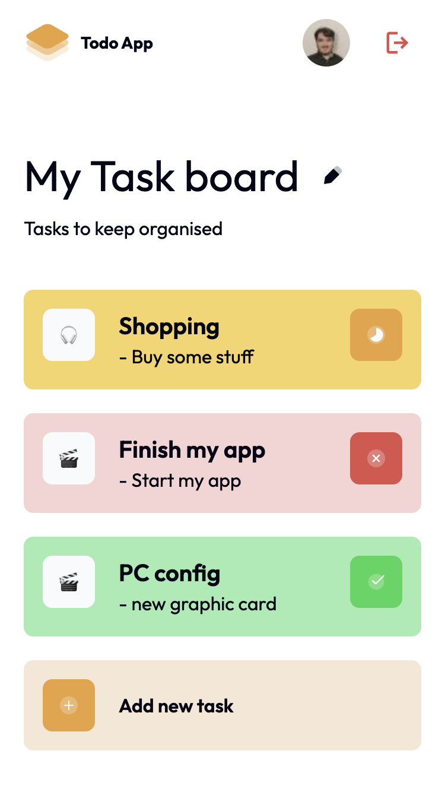

# My Task Board

Solution proposed for the challenge of the [DevChallenge](https://devchallenges.io/challenge/my-task-board-app) platform.

Check the [demo](https://my-task-board-challenge-production.up.railway.app/).

> Still in development: you need to go on login page directly to access the app. I need to implement a landing page.
> https://my-task-board-challenge-production.up.railway.app/login

## Todo list

- [ ] Create a simple task management application following the given design.
- [ ] By default, it should show a board with 4 tasks like in the design.
- [ ] When users select `Add new task` option, a new task is added with a default name.
- [x] Users can edit task name, description, icon, and status.
- [x] Users can delete tasks by selecting `Delete` button.
- [x] Users can edit board name and optionally, users can edit board description as well.
- [x] Each board can be accessed by a unique id, e.g: /board/:board-id
- [x] Deploy the solution and submit Repository URL and Demo URL.

## Stack used

- Authentication (Lucia)
- Authorization
- Tailwind CSS
- Next.js
- TypeScript
- Playwright
- Prisma

## How to Get Started

### Prerequisites

This app does uses Docker and Docker Compose to run a postgres database, so you will need to either have those installed, or modify the project to point to a hosted database solution.

## How to Run

1. `cp .env.sample .env`
2. `yarn install`
3. `docker compose up`
4. `yarn run dev`

## Env Setup

This app depends on an external service: **github oauth**. You'll need to following the steps below and make sure everything is setup and copy the necesssary values into your .env file:

### Database

This app uses postgres. Setup a database and get your **DATABASE_URL**.

### Github Provider

By default, this app only comes with the github provider which you'll need to setup:

1. https://github.com/settings/developers
2. Create a new OAuth App
3. Set the callback URL to `http://localhost:3000/login/github/callback`
4. Set the client id and secret inside of .env

- **GITHUB_CLIENT_ID**
- **GITHUB_CLIENT_SECRET**
